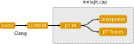

# A Prototype Just-in-Time Compiler for the UXN Virtual Machine

**Note:** The explanation below is currently being implemented. It is still unclear if it will work as intended (or if I will actually finish it).

uxnjit uses meta-tracing to automatically generate a tracing JIT from the `uxn.c` interpreter.
It uses the [metajit.cpp](https://github.com/can-lehmann/metajit.cpp) meta-tracing framework.
To allow for meta-tracing, uxnjit uses a modified version of `uxn.c` that includes the required annotations.
This version of `uxn.c` is lowered to LLVM IR using clang.
The resulting LLVM IR is then lowered to metajit.cpp's JITIR.

One major challenge in just-in-time compiling UXN is the fact that UXN's memory model allows for self-modifying code.
To handle this, uxnjit marks all memory locations which are assumed as constant in traces and invalidates traces when those memory locations are modified.

## License

Apache License, Version 2.0

`uxn.c` is licensed under the MIT License, see the license header in `uxn.c` for more information.